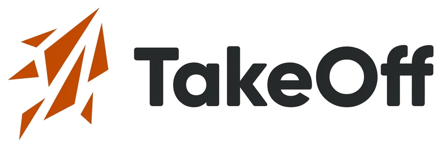
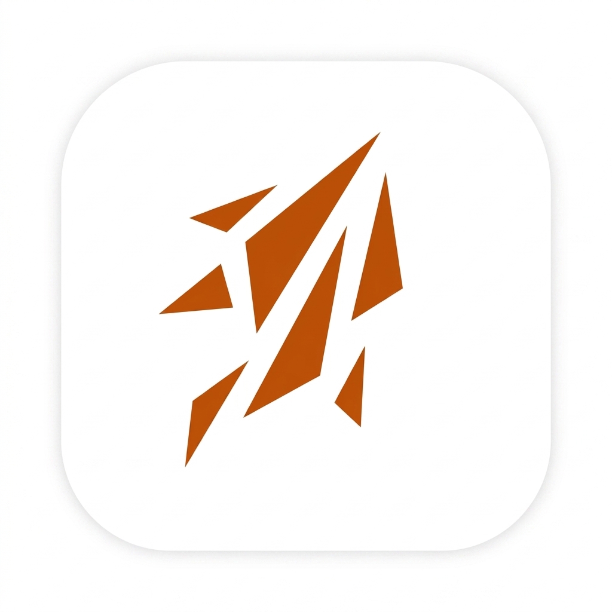

# TakeOff Companion — Marka Kiti

Bu doküman, TakeOff Companion mobil uygulamasının kod tabanında (`constants/theme.ts`,
`components/TakeOffLogo.tsx`, `assets/branding/`) tanımlı marka öğelerinin bir özetidir. Ayrı bir
resmi marka rehberi (Figma/PDF) proje içinde bulunmuyor — kaynak, aşağıdaki dosyalardır.

---

## 1. Logo

`components/TakeOffLogo.tsx` bileşeni, iki gerçek görsel varlık üzerine kurulu 4 varyant sunar:

| Varyant | Görsel | Açıklama |
|---|---|---|
| `horizontal` (varsayılan) | `assets/branding/takeoff-lockup.png` | Yatay logo lockup'ı |
| `mark-only` | `assets/branding/takeoff-app-icon.png` | Sadece amblem (kare) |
| `badge` | `assets/branding/takeoff-app-icon.png` | Amblem, sabit 80×80 rozet boyutunda |
| `white` | — | Prop olarak tanımlı ama ayrı bir görsel/stil karşılığı yok; şu an `horizontal` görseline düşüyor |

### Görseller

**Yatay lockup (`takeoff-lockup.png`)**



**Amblem / app icon (`takeoff-app-icon.png`)**



### Boyut ölçekleri

| Boyut | `mark-only` (kare) | `horizontal` (lockup) |
|---|---|---|
| `sm` | 24×24 | 96×32 |
| `md` | 32×32 | 120×40 |
| `lg` | 40×40 | 144×48 |
| `xl` | 64×64 | 192×64 |

### Uygulama ikonları (Expo asset seti)

`assets/` kökünde platform ikonları da bulunuyor:

- `icon.png`, `favicon.png`, `splash-icon.png`
- Android adaptive icon üçlüsü: `android-icon-background.png`, `android-icon-foreground.png`,
  `android-icon-monochrome.png`

---

## 2. Renk Paleti

Kaynak: `constants/theme.ts` (yorumda "Google Stitch tasarımından alınmıştır" notu var).

### Ana / vurgu renkleri

| Rol | Hex | Kullanım |
|---|---|---|
| `primary` | `#c85000` | Ana turuncu — CTA, aktif sekme, vurgular |
| `primaryDark` | `#a03e00` | Koyu turuncu |
| `primaryLight` | `#ffdbcc` | Açık turuncu |
| `primarySoft` | `#ffeedb` | En açık turuncu (arka plan tonu) |
| `accent` | `#E59E2D` | Rozet/gradient ikincil rengi (altın-amber) |

### İkincil renkler

| Rol | Hex | Kullanım |
|---|---|---|
| `secondary` | `#4c6173` | Soluk metin / ikincil ikon rengi |
| `secondaryDark` | `#34495b` | Koyu ikincil |
| `secondaryContainer` | `#cce2f8` | Açık mavi container |

### Yüzey / arka plan

| Rol | Hex |
|---|---|
| `background` | `#f8f9fa` |
| `surface` | `#ffffff` |
| `surfaceContainer` | `#edeeef` |
| `surfaceHigh` | `#e7e8e9` |
| `surfaceMuted` | `#f3f4f5` |

### Metin

| Rol | Hex |
|---|---|
| `text` | `#191c1d` |
| `textMuted` | `#4c6173` |
| `textFaint` | `#506578` |

### Kenarlık

| Rol | Hex |
|---|---|
| `border` | `#edeeef` |
| `borderStrong` | `#b3c9de` |

### Durum renkleri

| Rol | Hex |
|---|---|
| `success` | `#137333` |
| `successBg` | `#e6f4ea` |
| `successBorder` | `#ceead6` |
| `danger` | `#ba1a1a` |
| `dangerBg` | `#ffdad6` |
| `dangerBorder` | `#ffb4ab` |

### Gradient

```
gradient.primary = ['#c85000', '#E59E2D']  // turuncudan amber'e
```

---

## 3. Design Token'ları

### Spacing

| Token | Değer |
|---|---|
| `xs` | 4 |
| `sm` | 8 |
| `md` | 16 |
| `lg` | 24 |
| `xl` | 32 |

### Radius

| Token | Değer |
|---|---|
| `sm` | 8 |
| `md` | 12 |
| `lg` | 16 |
| `xl` | 24 |
| `full` | 999 (pill) |

### Typography

Ayrı bir font ailesi tanımlı değil, sistem fontu kullanılıyor.

| Stil | fontSize | fontWeight | Renk |
|---|---|---|---|
| `title` | 24 | 700 | `text` |
| `subtitle` | 16 | 600 | `text` |
| `body` | 14 | 400 | `textMuted` |
| `caption` | 12 | 500 | `textFaint` |

---

## 4. Kaynak Dosyalar

- [`constants/theme.ts`](constants/theme.ts) — renk paleti, gradient, spacing, radius, typography
- [`components/TakeOffLogo.tsx`](components/TakeOffLogo.tsx) — logo bileşeni ve varyantları
- [`assets/branding/`](assets/branding/) — logo görselleri
- [`assets/`](assets/) — uygulama/platform ikonları
